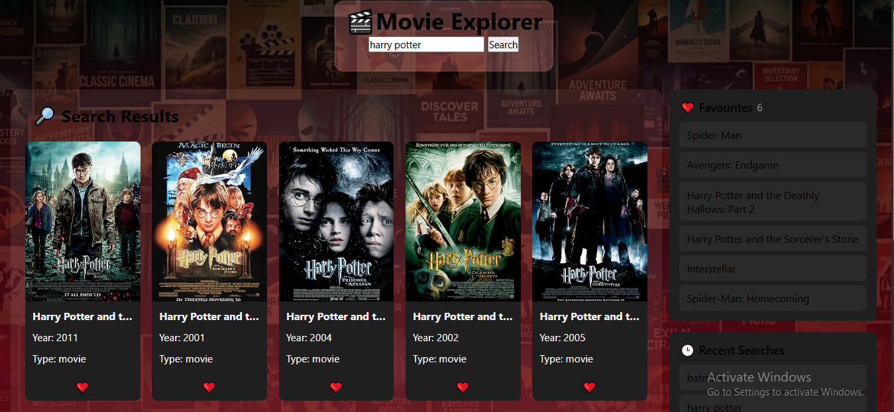

# 🎬 Movie Explorer

A modern Movie Explorer web app built using HTML, CSS, and JavaScript. Search movies instantly using the OMDb API, save your favorite movies, and keep track of your recent searches.

## 🚀 Features

- 🔍 Search movies using the OMDb API
- 🔥 Random Trending Movies on page load
- ❤️ Add movies to Favorites
- 💾 Favorites saved using Local Storage
- 🕒 Recent Search History
- 📱 Responsive Design
- 🎨 Clean Netflix-inspired UI

## 🛠️ Tech Stack

- HTML5
- CSS3
- JavaScript (ES6)
- OMDb API
- Local Storage

## 📸 Screenshots

### Home Page

## 🌐 Live Demo
 https://pragati0405.github.io/Movie-Explorer/
 

## 📂 Repository

https://github.com/pragati0405/Movie-Explorer

## 👩‍💻 Author

**Pragati**
